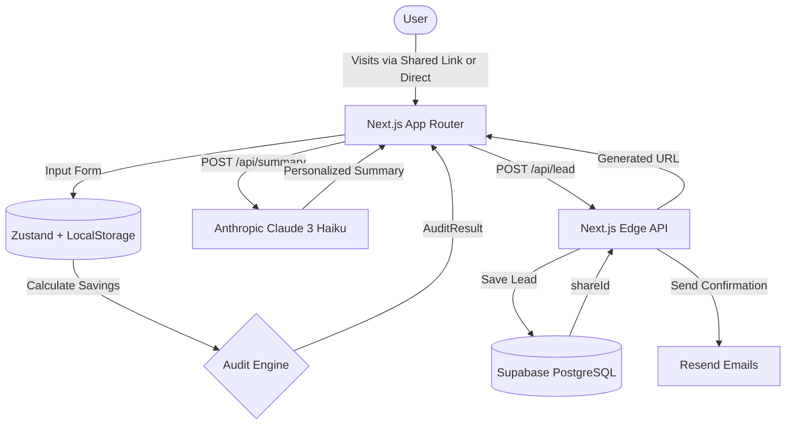

# Architecture

## System Diagram

## Data Flow
1. **Input:** The user inputs their tool spend via a multi-step form built with `react-hook-form` and `zod`. State is persisted immediately via `zustand` to `localStorage` to survive page reloads.
2. **Audit:** Upon submission, the pure TypeScript `AuditEngine` evaluates the stack using hardcoded financial rules and current pricing data.
3. **AI Generation:** The frontend hits the `/api/summary` Next.js route, which securely calls the Anthropic API to generate a 100-word executive summary.
4. **Lead Capture:** If the user enters their email, the frontend hits `/api/lead`. This route inserts the data into Supabase and triggers a transactional email via Resend, returning a unique `shareId`.
5. **Viral Loop:** The user is given a `stackaudit.credex.rocks/share/{shareId}` URL. When accessed, Next.js SSR reads the ID, generates dynamic Open Graph tags, and renders the result.

## Why This Stack?

- **Next.js App Router:** Chosen for its seamless blend of client-side interactivity (the complex form) and server-side rendering (critical for generating Open Graph metadata on the shareable URLs).
- **TypeScript & Zod:** Type safety from the form input all the way to the API route payload ensures no runtime crashes from malformed data.
- **Tailwind + shadcn/ui + Framer Motion:** Allowed for rapid development of a "Stripe-like", premium aesthetic without fighting a heavy UI library.
- **Supabase + Resend:** The fastest path to a production-grade database and transactional email setup without managing infrastructure.
- **Zustand:** Lighter and less boilerplate than Redux, but far more robust than raw React Context for persisting the multi-step form state across reloads.

## Scaling to 10k Audits/Day

If this tool went viral and hit 10k audits/day, I would change:
1. **Caching the AI Summary:** Currently, every audit generates a new API call to Anthropic. At 10k/day, this costs money and adds latency. I would hash the `AuditResult` input and check a Redis cache (Upstash) before calling Anthropic. Identical stacks get identical summaries instantly.
2. **Rate Limiting:** Implement Upstash Redis rate limiting on the `/api/lead` and `/api/summary` routes to prevent abuse (e.g., 5 requests per IP per minute).
3. **Background Jobs for Emails:** Instead of awaiting the Resend API call in the main Edge function (which could cause timeouts), I would push the email job to a queue (like Inngest or QStash) to ensure the API responds to the user instantly.
